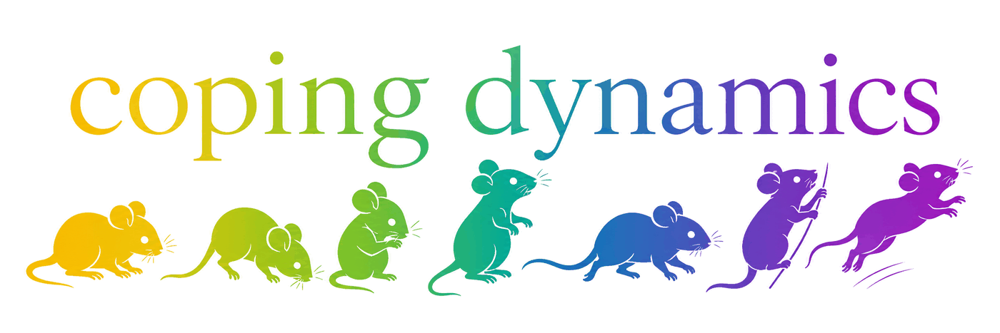
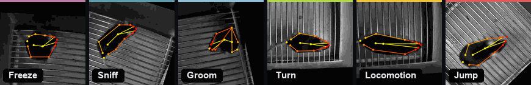
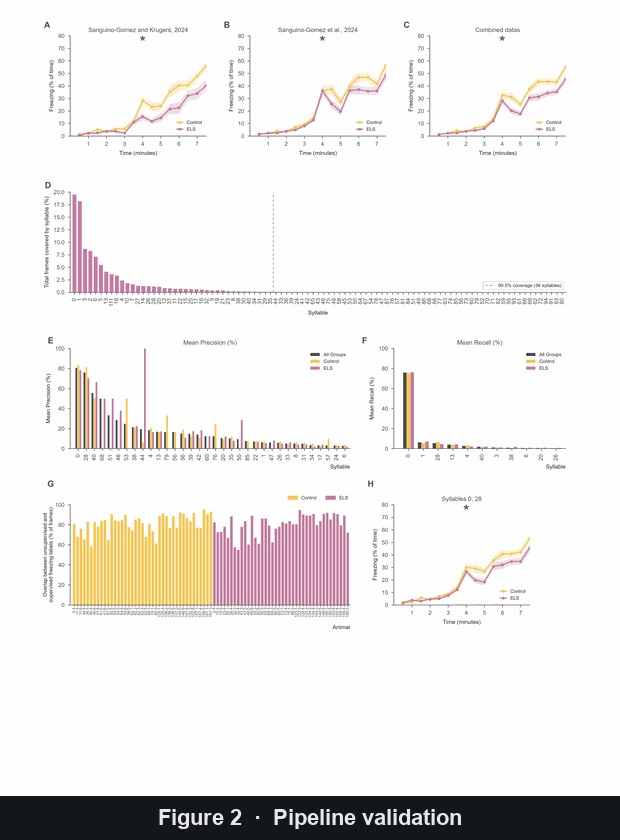

<p align="center">
  
</p>

# Coping Dynamics Sequencing

[](https://github.com/antonio-lozano/coping-dynamics-sequencing/actions/workflows/reproducibility.yml)
[](LICENSE)
[](pyproject.toml)

**[Project page &rarr; antonio-lozano.github.io/coping-dynamics-sequencing](https://antonio-lozano.github.io/coping-dynamics-sequencing/)**
&mdash; the study in five minutes: the behavioural repertoire, the paradigm, the
findings, and the two coping profiles. The same page is committed as a print
version at [`docs/web/coping-dynamics-sequencing.pdf`](docs/web/coping-dynamics-sequencing.pdf),
regenerated by `scripts/build_page_pdf.py`.

Self-contained manuscript repository for the behavioral motif, freezing, and
stress-coping dynamics analyses. All data required to rebuild the data-derived
figures, statistical CSVs, Excel reports, and validation manifest are included
in the repository.

<p align="center">
  
</p>
<p align="center"><sub>One representative keypoint-MoSeq syllable per behavioral
cluster, from the same verified sources as
<a href="supplementary_media/Supplementary_Video_1_MoSeq_syllable_atlas_grid.mp4">Supplementary
Video 1 (grid view)</a>.</sub></p>

## Quick Start

The same commands work on Windows and Linux. Use the locked `uv` environment
when possible: it installs the Python recorded in `.python-version` itself, and
resolves from `uv.lock`, so every machine gets identical versions.

```bash
uv sync --locked
uv run python scripts/check_reproducibility.py
```

Alternative environments:

```bash
conda env create -f environment.yml
conda activate coping-dynamics
python scripts/check_reproducibility.py
```

```bash
python --version  # Python 3.10 or 3.11
python -m venv .venv
# Windows:  .venv\Scripts\activate
# Linux:    source .venv/bin/activate
pip install -r requirements.txt
python scripts/check_reproducibility.py
```

## Rebuild Everything

Run commands from the repository root. The `uv run` prefix shown below is only
needed for the `uv` route; with conda or pip, activate the environment first and
call `python` directly.

```bash
uv run python scripts/run_all.py
```

This rebuilds the compact freezing-prediction tables, processed analysis
tables, data-derived figures, raw-data workbook, full and source-dataset
statistical report, artifact manifest, and
reproducibility checks. Add `--verbose` to stream each
child script's output. Add `--skip-figures` to rebuild tables, reports, the
manifest, and checks without re-rendering figures.

Targeted rebuilds:

```bash
uv run python scripts/run_all_figures.py
uv run python scripts/build_raw_data_workbook.py
uv run python scripts/build_statistical_report.py
uv run python scripts/update_manifest.py
uv run python scripts/check_reproducibility.py
uv run python scripts/check_manuscript.py
```

## Repository Contract

```text
data/raw/             Immutable bundled inputs used by the analyses
data/processed/       Deterministic tables regenerated from data/raw
figure_source_data/   Plotted values and summary values behind Figures 2-7
statistics/           Machine-readable statistical model outputs
figures/              Canonical manuscript figure exports
report/               raw-data workbook and canonical statistical report
classifier/           Classifier artifact used in Figure 7A-C and Supplementary Figure 4
supplementary_media/  Submission-ready audiovisual supplement and source index
scripts/              Rebuild, report, figure, and validation entry points
scripts/migrations/   One-time imports from the legacy tree, kept for provenance
coping_dynamics/      Shared analysis, plotting, statistics, and classifier code (installed package)
docs/                 Data dictionary and focused provenance notes
config/               Figure metadata used by the report package
tools/                Self-contained companion tools, outside the rebuild and the manifest
```

Two kinds of scripts are not part of a rebuild. `scripts/migrations/` holds the
one-time utilities that imported the legacy SHAP analysis; they need `--source`
pointing at the legacy keypoint-MoSeq tree, which is not part of this
repository. `scripts/update_bundled_manuscripts.py` rewrote the Results
statistics of the two manuscript copies in `report/` for one specific model
change and goes stale at the next edit; see its docstring.
`scripts/check_manuscript.py`, not that script, is what proves the copies are
current.

`data/raw/` contains inputs. `data/processed/`, `figure_source_data/`,
`statistics/`, `figures/`, and `report/` are regenerated products. The term
`figure_source_data` is used only for the plotted data underlying manuscript
figures, not for raw experimental inputs.

The statistical builder creates one canonical output:

- `report/statistical_report.xlsx` recalculates the Combined full dataset,
  Sanguino-Gomez & Krugers, and Sanguino-Gomez et al. analyses where source
  dataset identity is available. It includes raw and adjusted p-values, direct
  resilience contrasts, per-time-bin posthoc tests, model/sample metadata,
  time-effect units, and the manuscript consistency audit.

The historical report is retained as transparent source-cell records under
`data/raw/manuscript_tables/statistical_report/`; it is provenance, not a
second final workbook. See `docs/workbook_match_audit.md` for details.

## Key Data

Raw inputs include:

- `data/raw/freezing_predictions/`: 98 original per-animal supervised freezing
  prediction CSVs.
- `data/raw/freezing_predictions_light.csv.gz`: compact long-format companion
  generated from the per-animal prediction CSVs.
- `data/raw/freezing_predictions_index.csv`: file-level index with frame counts,
  freezing fractions, byte sizes, and SHA-256 checksums.
- `data/raw/moseq_syllables_per_frame.csv.gz`: per-frame MoSeq syllable table.
- `data/raw/simba_validation_manual_vs_automatic.csv`: manual versus automatic
  SimBA freezing validation values.
- `data/raw/syllable_usage_per_timebin_30s.csv` and
  `data/raw/syllable_usage_per_timebin_250ms.csv`: time-bin syllable usage.
- `data/raw/behavioral_flexibility_scores.xlsx`: behavioral flexibility score
  table used for resilience grouping.

## Figure Scripts

<p align="center">
  
</p>
<p align="center"><sub>The main data figures, each rebuilt byte-identically by
<code>scripts/run_all.py</code>.</sub></p>

| Output | Script |
| --- | --- |
| Figure 1 | Canonical tracked export (hand-assembled schematic) |
| Figure 2 | `scripts/generate_figures/figure_2_validation.py` |
| Figure 3 | `scripts/generate_figures/figure_3_behavior_clusters.py` |
| Figure 4 | `scripts/generate_figures/figure_4_diversity_dynamics.py` |
| Figure 5 | `scripts/generate_figures/figure_5_resilience_dynamics.py` |
| Figure 6 | `scripts/generate_figures/figure_6_resilience_diversity.py` |
| Figure 7 | `scripts/generate_figures/figure_7_resilience_prediction.py` |
| Supplementary Figure 1 | `scripts/generate_figures/supplementary_figure_1_tracking_clusters.py` |
| Supplementary Figure 2 | Canonical tracked export (analysis workflow schematic) |
| Supplementary Figure 3 | `scripts/generate_figures/supplementary_figure_3_distances.py` |
| Supplementary Figure 4 | `scripts/generate_figures/supplementary_figure_4_classifier_shap.py --source DIR` |
| Supplementary Figure 5 | Canonical tracked export (convex-hull climbing validation) |

Figures 1 and Supplementary Figure 2 are tracked as canonical assembled
manuscript figures. Figure 7 is regenerated from tracked source tables and the
prediction analysis. Supplementary Figure 5 is a canonical assembled climbing-validation export.
Supplementary Figure 4 is a legacy figure: its panels come from the archived
classifier in `classifier/legacy_shap/`, not from
`classifier/figure7_behavior_classifier.joblib`. See `docs/figure_structure.md`.

## Supplementary Media

`supplementary_media/Supplementary_Video_1_MoSeq_syllable_atlas.mp4` is a
submission-ready H.264 atlas of representative pose-overlaid syllables and
canonical skeleton trajectories, and
`Supplementary_Video_1_MoSeq_syllable_atlas_grid.mp4` is its grid view: all 25
cluster-mapped syllables playing simultaneously, ordered and color-coded by
behavioral cluster. The editable submission legend is in `report/SIGuide.docx`,
and `Supplementary_Video_1_source_index.csv` records the source hashes both
videos are verified against. Regenerate them from the archived keypoint-MoSeq
outputs with:

```bash
python scripts/generate_supplementary_video_1.py \
  --clip-dir PATH/TO/video_clips \
  --skeleton-gif PATH/TO/skeleton_trajectories.gif
python scripts/generate_supplementary_video_1_grid.py \
  --clip-dir PATH/TO/video_clips
```

See `docs/supplementary_media.md` for scope and provenance.

## Quality Controls

- `MANIFEST.csv` records byte sizes and SHA-256 hashes for tracked publication
  artifacts.
- `scripts/check_manuscript.py` checks every statistic in the manuscript
  against `statistics/`, `report/statistical_report.xlsx`, and the significance
  markers drawn on the figures, and fails if any of the four disagree or if the
  manuscript quotes a statistic the script does not cover.
- `scripts/check_reproducibility.py` verifies required files, figure exports,
  98 raw freezing prediction CSVs, manifest hashes, retired-path absence,
  absence of local absolute paths in text files, and absence of local tool
  traces.
- `tests/` is the root test suite: golden values pinning the canonical metric
  implementations in `coping_dynamics/statistics.py`, cross-implementation agreement
  checks, the layout checker under pytest, and slow-marked double-build
  determinism tests. Run `uv run pytest -m "not slow"` for the fast selection.
- `.github/workflows/reproducibility.yml` runs four jobs on GitHub: source
  guards (pre-commit hooks, `uv lock --check`, citation metadata validation),
  the locked-environment checks on Ubuntu and Windows (install, import smoke
  check, compile sweep, layout checker, fast tests), the vendored classifier
  tool's own test suite in its own locked environment, and an informational
  full rebuild of the pipeline with double-build determinism tests.
- `.pre-commit-config.yaml` guards commits locally: oversized files, merge
  conflict markers, malformed YAML/TOML/JSON, whitespace, and ruff lint and
  formatting for hand-written sources. Enable with `uvx pre-commit install`.
  Hooks never touch generated artifacts or `tools/`.
- All default paths resolve inside the repository through
  `coping_dynamics/config.py`.

## Additional Documentation

- `REPRODUCIBILITY.md`: exact rebuild and validation workflow.
- `DATA_AVAILABILITY.md`: manuscript-facing data availability language.
- `CODE_AVAILABILITY.md`: manuscript-facing code availability language.
- `docs/data_dictionary.md`: file-level description of inputs and outputs.
- `docs/figure4_coping_provenance.md`: Figure 4 analysis provenance.
- `docs/figure_structure.md`: canonical main and supplementary panel mapping.
- `docs/behavior_classifier.md`: classifier and Supplementary Figure 4 usage.
- `docs/cleanup_todo.md`: known loose ends and pending cleanup decisions.
- `docs/manuscript_statistics_validation/`: independent validation of the
  statistics reported in the manuscript (Wald-identity checks plus mixed-model
  re-fits), with the HTML report and the scripts that rebuild it under
  `scripts/analysis/`.
- `tools/behavior_dlc_classifier/GUIDE.md`: standalone DeepLabCut freezing and
  seven-behavior video classifier with its own environment and lock file,
  outside the reproducibility contract and unrelated to the Figure 7
  classifier in `classifier/`.

## Citation and licensing

Software citation metadata lives in `CITATION.cff`; GitHub's "Cite this
repository" button reads it, and CI validates it on every push. `.zenodo.json`
carries the metadata for the archived release: Zenodo reads it in preference to
`CITATION.cff`, so the two are kept in agreement by hand. The Zenodo DOIs are
added to `CITATION.cff` once the first release is archived.

Code is released under the MIT License (`LICENSE`). The bundled data —
`data/`, `figure_source_data/`, `statistics/`, `report/` and
`supplementary_media/` — are released under Creative Commons Attribution 4.0
International (`LICENSE-DATA`).

`docs/publication_release.md` is the release runbook: how the code and dataset
DOIs are minted and cross-linked, what the journal requires of the data and
code availability statements, and draft wording for both.
