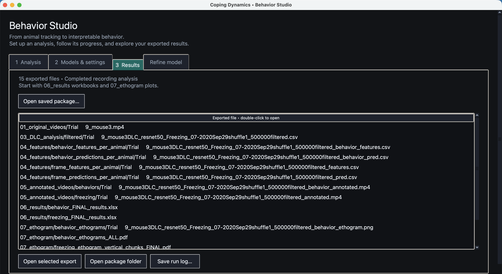

# Behavior Studio

> Model weights and app demo recordings are separate assets. During the data embargo, obtain the authorized archive from the authors; run `python scripts/install_app_assets.py /path/to/behavior-studio-assets.zip` from the repository root before following bundled-model examples. The public dataset reference is DOI `10.6084/m9.figshare.33439885`. No private download link is included.

**A desktop workspace for turning DeepLabCut tracking into behavioral results.**
Score freezing and seven behaviors, export per-frame predictions and Excel
summaries, generate ethograms, and review annotated videos.

[Installation & quickstart](GUIDE.md#installation) · [Desktop walkthrough](GUIDE.md#the-desktop-interface) · [Full guide](GUIDE.md) · [Changelog](CHANGELOG.md)

*Native macOS workspace, cropped to the results browser; exports from the bundled recording example.*

## Your workflow

1. **Analysis:** select raw videos or reuse existing filtered tracking.
2. **Models & settings:** review models, frame rate and arena calibration.
3. **Results:** open the exported workbooks, plots and videos directly, or reopen a saved package without running analysis.
4. **Refine model:** label videos or reuse saved labels, follow training progress,
   and select a separate freezing model for the next analysis.

The CLI remains available as `freezing-dlc`; launch the desktop workspace with
`freezing-dlc-gui`. See the guide for installation, platform-specific Tk support
and the optional DeepLabCut environment. The root research environment and this
application have separate dependencies.

Every analysis creates a new results package. Original data and bundled models
are retained. Review predictions for your recording setup before interpreting
biological results; the supplied models are not universal behavior detectors.

Part of [Coping Dynamics](../../README.md).

### Keyboard and small windows

Use Tab / Shift+Tab between controls, Ctrl+Tab between workspace tabs, Space on
buttons, and Enter to open a selected export. Focused fields scroll into view;
small windows provide horizontal and vertical scrollbars.
